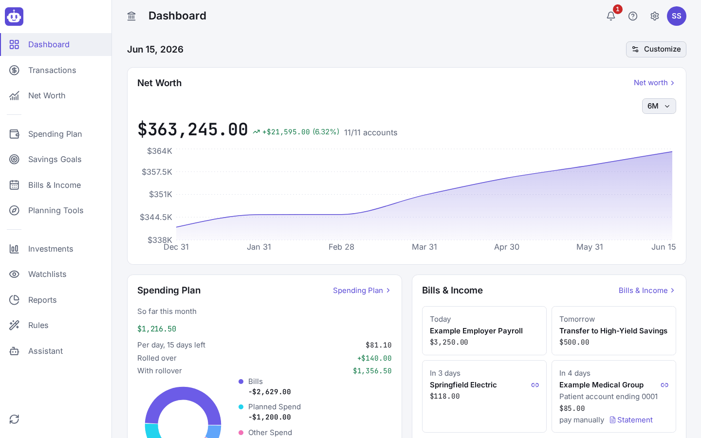
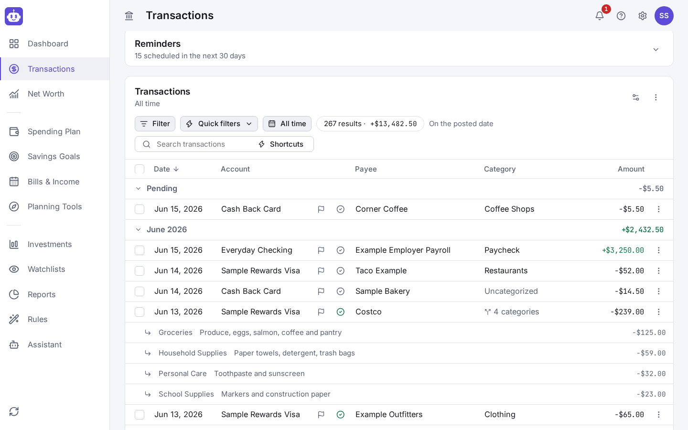
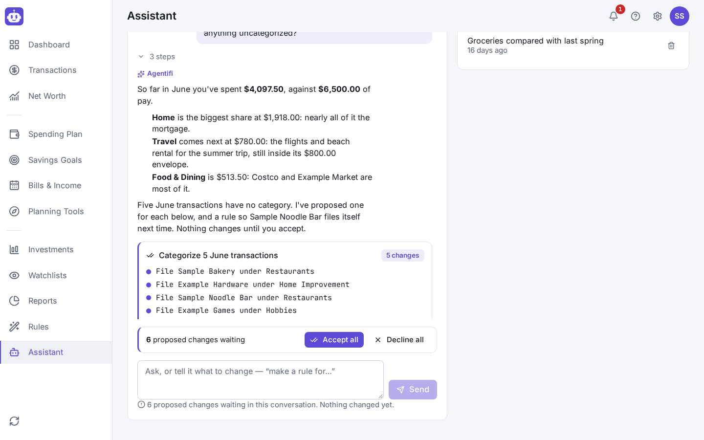
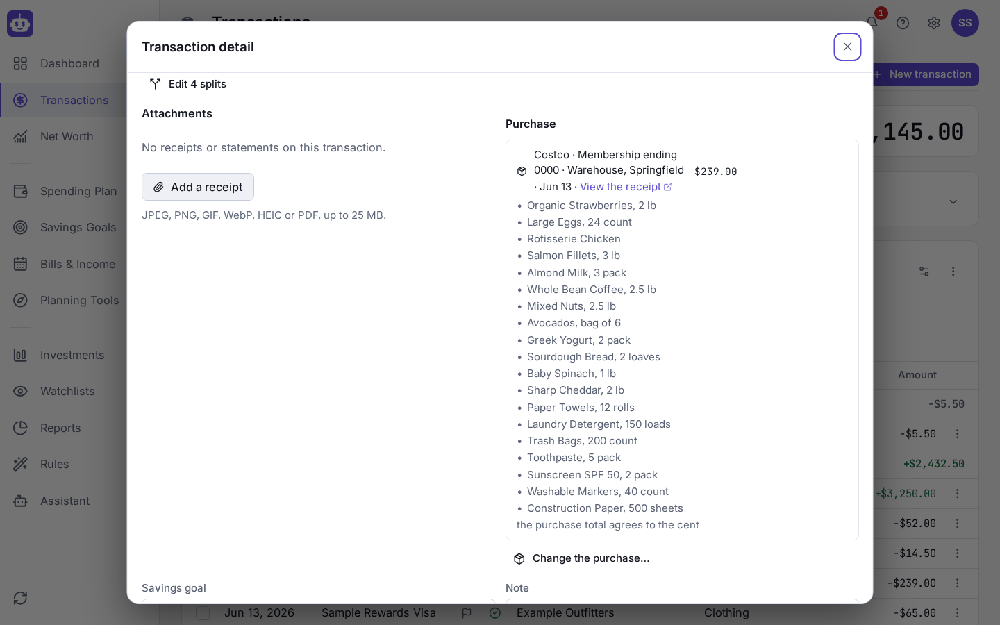
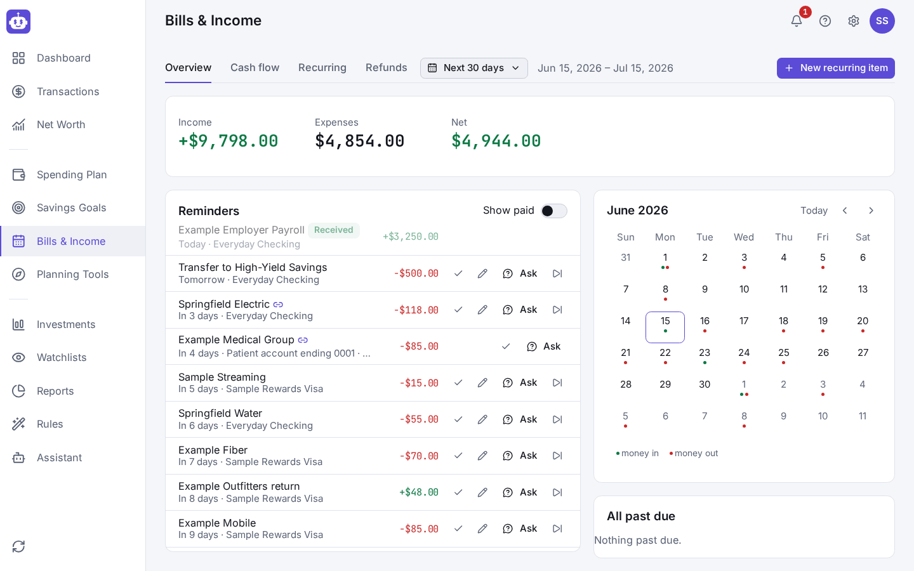
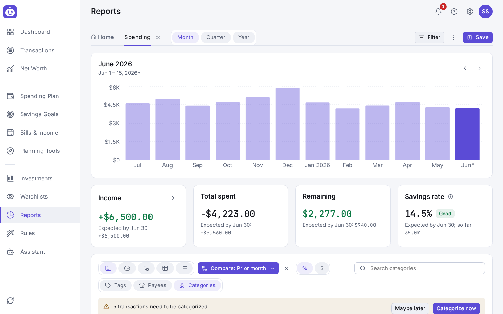
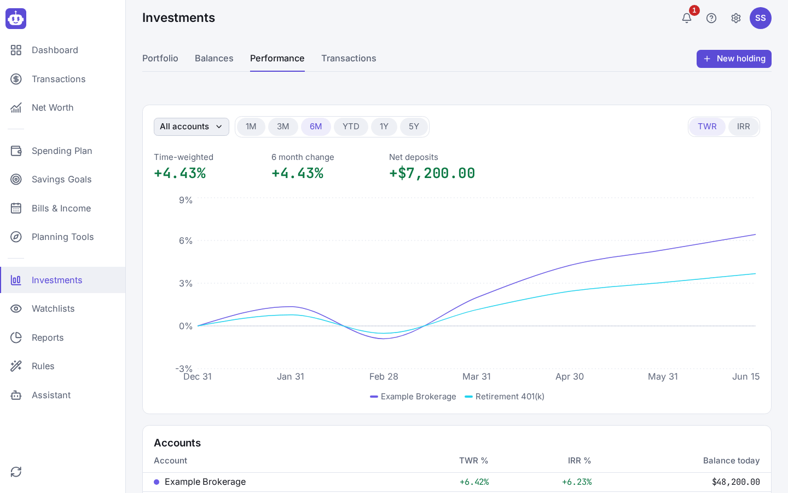
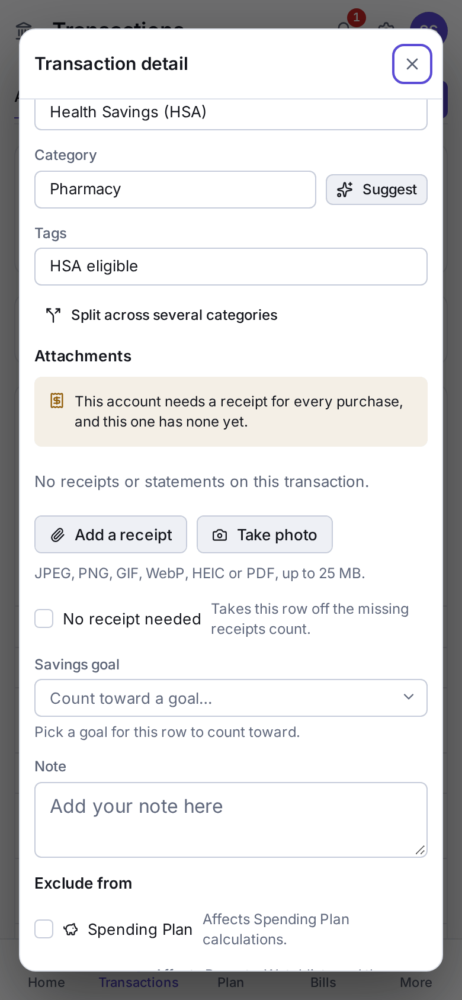

# Agentifi

Agentifi is a self-hosted personal finance manager modelled on Quicken
Simplifi. Your data lives on your own server in your own Postgres, bank
transactions arrive through [SimpleFIN](https://www.simplefin.org/), and an
optional AI assistant — a model you choose, including one you host yourself —
can read your ledger and propose changes for you to accept.

https://github.com/user-attachments/assets/6981f7f5-dc40-45fc-8943-126c663063e6

*A two-minute tour: the dashboard, the assistant proposing categories, a
Costco receipt split by item and an HSA receipt being attached. Every name and
figure in it is invented. The film is also
[`docs/screenshots/demo.mp4`](docs/screenshots/demo.mp4).*

**Agentifi is an independent project. It is not affiliated with, endorsed by
or sponsored by Quicken Inc., Intuit, or any other company named in this
repository.** Product names are used only to describe compatibility.

## Why

- **Your finances stay private.** Nothing leaves your server except the
  connections you choose to make.
- **Keep your history.** A Simplifi user can bring their whole dataset
  across: accounts, categories, rules, the spending plan, goals and
  transaction history.
- **Automate the chores.** Bills are fetched and matched to the payments
  that settle them, receipts are matched to bank rows, and the assistant can
  suggest categories and other changes for a person to accept.

## Features

- Accounts and net worth, across checking, savings, credit cards, loans,
  investments and assets.
- A transaction register with search, splits, transfers and one shared
  filter model used by the register, reports and watchlists.
- Categories, tags and rules that rename, categorize, tag and exclude rows.
- A monthly spending plan with planned-spend envelopes, savings goals and
  watchlists.
- Recurring bills, subscriptions and income, with an Upcoming list and a
  cash-flow projection.
- Reports: spending, income, cash flow, net worth, investments and taxes.
- Bank sync through SimpleFIN, the only supported bank aggregator.
- Import from a Simplifi export, or from CSV and OFX/QFX statements.
- Bill-provider connectors that sign in to utility, insurance and phone
  accounts to fetch statements, with autopay tracking and pay-manually
  reminders.
- Receipt handling, including HSA/FSA receipts and photos from a phone.
- Amazon and Costco order matching, down to the item.
- An assistant (any OpenAI-compatible model, including one you host) that
  proposes rules, categorizations, bulk category suggestions and other
  changes as cards you accept, so a person decides and nothing applies
  itself.
- Multiple people and spaces (a household, a side business), each with a
  role.
- Passkeys, TOTP and OIDC single sign-on.
- Nightly, encrypted backups.

See the [documentation index](docs/README.md) for how each of these works.

## Screenshots

All of them show an invented household.

| | |
| --- | --- |
|  |  |
| **Dashboard:** net worth, the month's plan, bills due and what needs review. | **Register:** a Costco charge split across four categories by what was bought. |
|  |  |
| **Assistant:** an answer from the ledger, with proposed changes to accept or decline. | **Merchants:** the receipt's items, matched to the card charge to the cent. |
|  |  |
| **Bills & Income:** what's due, autopay, and a bill to pay by hand. | **Reports:** this month's spending against last month's, by category. |
|  |  |
| **Investments:** performance across the brokerage and the 401(k). | **Receipts:** an HSA purchase without one, ready for a photo. |

## Quick start

You need an x86-64 Linux host with Docker and Docker Compose 2.24 or later.

```sh
git clone https://github.com/CornHead764/agentifi.git
cd agentifi
docker compose up -d
```

Nothing has to be set first: the database password, `SECRET_KEY` and the
other secrets are generated on the first start. Open <http://localhost:8100>; a server with no
accounts offers to create one on the sign-in screen, and that first account
administers the server. From there, follow the in-app setup guide to import
a Simplifi export and connect SimpleFIN.

The first start also downloads Google Chrome, which the bill and merchant
connectors drive, from Google into a volume; the image does not include it,
and Chrome is subject to Google's terms. Everything else works without it.

Details, HTTPS, upgrades, backups and restoring are in
[`docs/operations.md`](docs/operations.md).

## Configuration

Settings go in a `.env` beside `docker-compose.yml`, and none is required.
[`docs/configuration.md`](docs/configuration.md) lists every one.

## Development

See [`CONTRIBUTING.md`](CONTRIBUTING.md).

## Security

See [`SECURITY.md`](SECURITY.md) to report a vulnerability.

## License

Agentifi is free software, released under the GNU General Public License,
version 3 or (at your option) any later version. The full text is in
[`LICENSE`](LICENSE).
